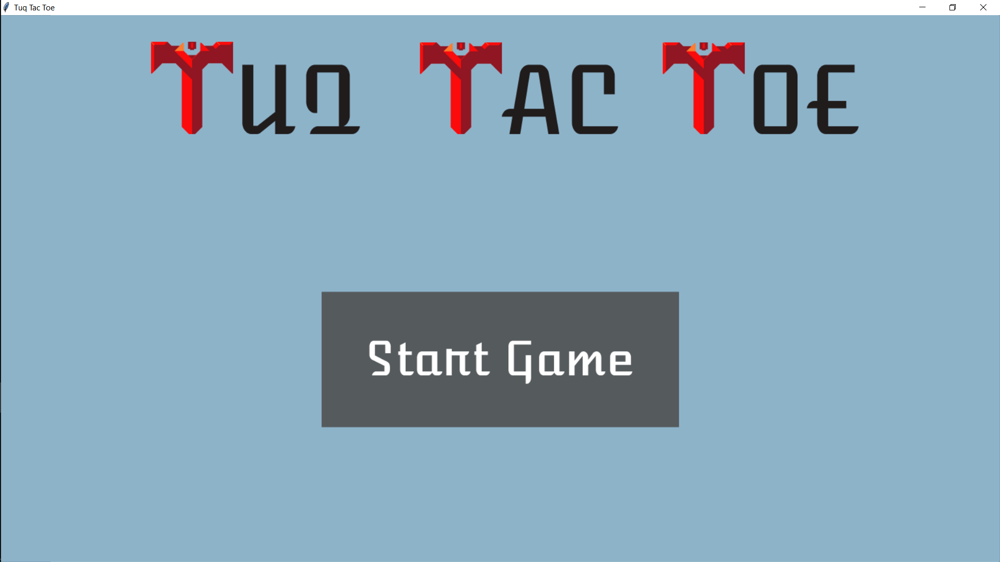
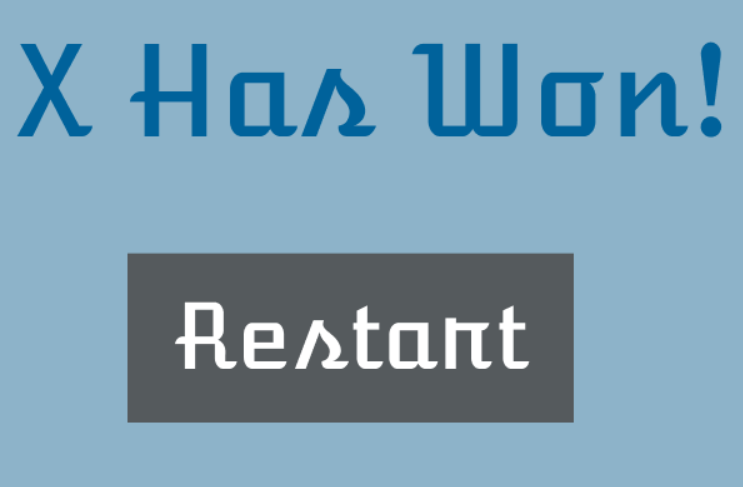
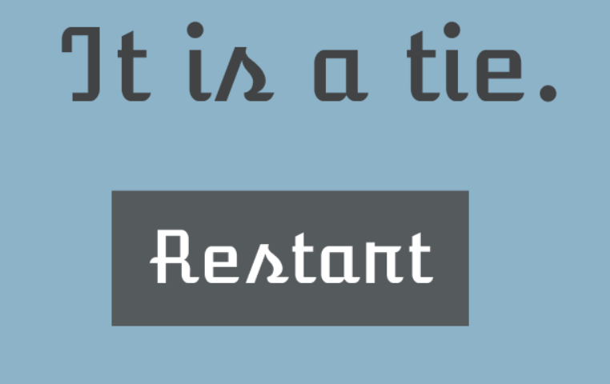

# tuq-tac-toe
Replica of Tic Tac Toe made for Tuq job application. Implemented user interface using Tkinter in Python.

## How to Use

1. Run main.py using VSCode or any console
2. Enjoy!

## Screenshots of app in action

login page!

 

   
Win text if X, O, or Tie

Here is the app in action!
