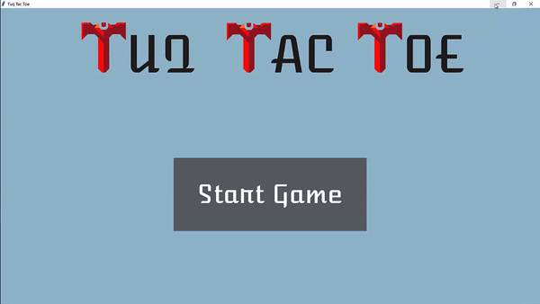

# tuq-tac-toe
Replica of Tic Tac Toe made for Tuq job application. Implemented user interface using Tkinter in Python.

## How to Use

1. Run main.py using VSCode or any console
2. Enjoy!

 

## The app in action

Here is the app in action!
